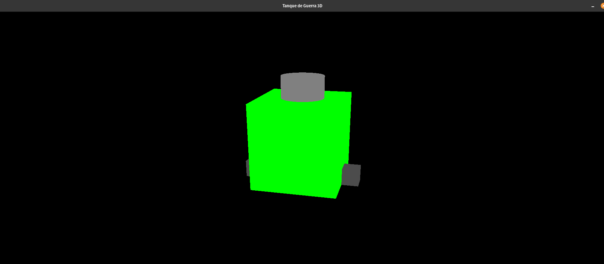

## Introdução

Esse é um projeto que tem como intuíto construir algumas animações de um tanque de guerra.

Bibliotecas usadadas: 
- GLFW
- Glad 
- GLM 


# Como usar os helpers

Essa class tem métods estáticos para ajudar desenhar formas geométricas de maneira mais simples.

## Funções Disponíveis

Desenha um cubo com as cores RGB, nas posições dos eixos x,y,z e escala

`Helpers::drawCube(float r, float g, float b, float x, float y, float z, float scale)`

Desenha um cilindro com as cores RGB, nas posições dos eixos x,y,z e escala
`Helpers::drawCylinder(float r, float g, float b, int segments, float x, float y, float z, float scale)`


## Controle de camêra

O controle da câmera é baseado no movimento do mouse e é implementado usando um callback para capturar eventos de movimento do mouse. A câmera gira em torno do tanque com base na posição do mouse.

`mouse_motions(GLFWwindow* window, double x, double y);`
Captura o movimento do mouse e atualiza os ângulos de rotação da câmera. Quanto mais o mouse se move, maior é a alteração dos ângulos.

`glfwSetInputMode(window, GLFW_CURSOR, GLFW_CURSOR_NORMAL);`

Define o modo do cursor para GLFW_CURSOR_NORMAL, permitindo que o cursor se mova livremente dentro e fora da janela do aplicativo. Isso é útil para permitir que o usuário mova o mouse para fora da janela enquanto ainda controla a câmera.


```c++
float cameraX, cameraY, cameraZ;
updateCameraPosition(cameraX, cameraY, cameraZ);
glLoadIdentity();
gluLookAt(cameraX, cameraY, cameraZ, 0.0, 0.0, 0.0, 0.0, 1.0, 0.0);
```


## Imagem do tanque atual


